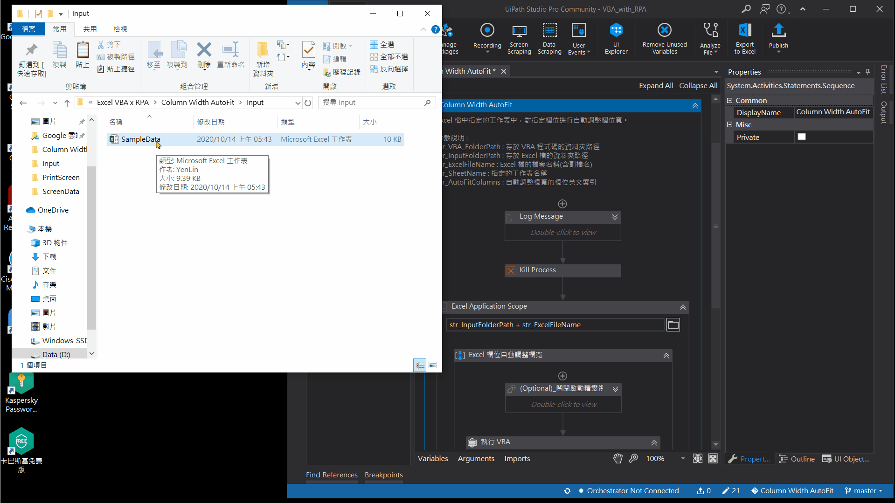

# Column Width AutoFit     
> RPA 機器人執行 VBA 程式碼，在 Excel 檔指定的工作表中，對指定的欄位進行自動調整欄位寬。   

## VBA 語法參考資料  
- [Range 物件 (Excel)](https://docs.microsoft.com/zh-tw/office/vba/api/excel.range(object))   
- [Range.Columns 屬性 (Excel)](https://docs.microsoft.com/zh-tw/office/vba/api/excel.range.columns)   
- [Sheets.Select 方法 (Excel)](https://docs.microsoft.com/zh-tw/office/vba/api/excel.sheets.select)
- [Range.AutoFit 方法 (Excel)](https://docs.microsoft.com/zh-tw/office/vba/api/excel.range.autofit)  
 
## 作者
 - &copy; Tom Wu (<a href="https://github.com/YenLinWu">Github</a>)   
