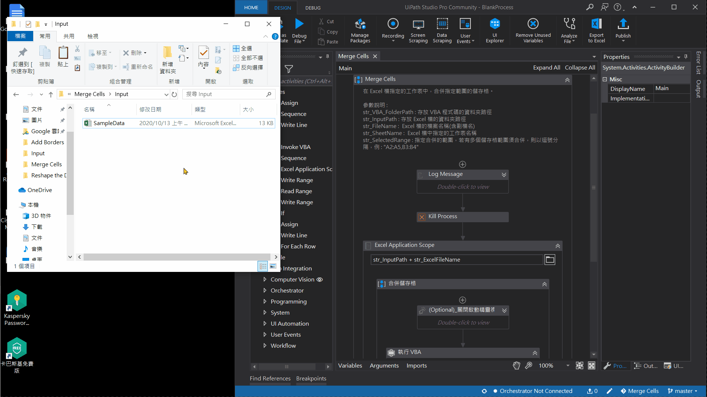

# Merge Cells   
> RPA 機器人執行 VBA 程式碼，在 Excel 檔指定的工作表中，合併指定範圍的儲存格。   

## VBA 語法參考資料  
- [Range 物件 (Excel)](https://docs.microsoft.com/zh-tw/office/vba/api/excel.range(object))   
- [Range.Merge 方法 (Excel)](https://docs.microsoft.com/zh-tw/office/vba/api/excel.range.merge)   
- [Split 函數](https://docs.microsoft.com/zh-tw/office/vba/language/reference/user-interface-help/split-function)   
- [For...Next 陳述式](https://docs.microsoft.com/zh-tw/dotnet/visual-basic/language-reference/statements/for-next-statement)   
- [Excel VBA Split Function – A Complete Guide](https://excelmacromastery.com/vba-split/ "參考資料")  
- [Excel VBA Merge Cells: Step-by-Step Guide and 6 Code Examples to Merge or Unmerge Cells with Macros](https://powerspreadsheets.com/excel-vba-merge-cells/ "參考資料")
 
## 作者
 - &copy; Tom Wu (<a href="https://github.com/YenLinWu">Github</a>)   
