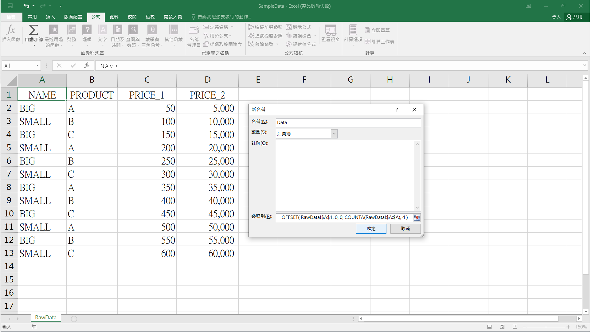
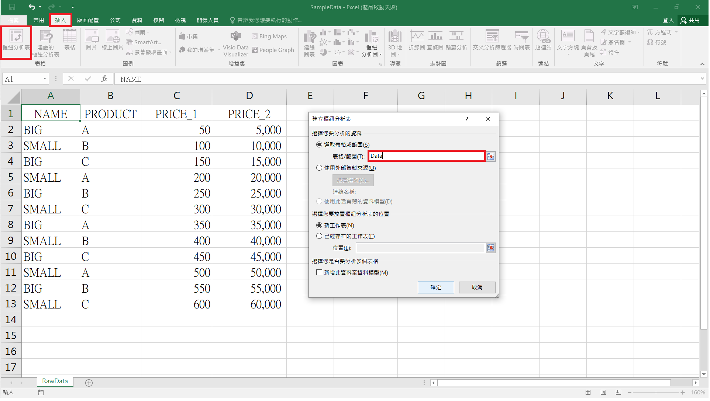

# Refresh Pivot Table   
> RPA 機器人執行 VBA 程式碼，更新 Excel 檔中所有的樞紐分析表(Pivot Table)。   


## 注意事項  
當在原始 Excel 檔新增資料後，並重新整理樞紐分析表時，樞紐分析表中的數據可能不會隨之更新。為避免遭遇此問題，當一開始在 Excel 檔中建立樞紐分析表時，建議以動態定義的範圍(Dynamic Named Range)來建立樞紐分析表。  
<br/>
在本範例中，建立樞紐分析表的步驟:  
- Step 1: 使用 OFFSET 及 COUNTA 函數建立動態定義的範圍  
> &emsp; 【公式】 &rarr; 【名稱管理員】 &rarr; 【新增】  
> &emsp;  &rarr; 新增名稱為 "Data" 且在參照到(R)中輸入 ``` = OFFSET(RawData!$A$1,0,0,COUNTA(RawData!$A:$A),4) ``` &rarr; 【確定】 &rarr; 【關閉】  
> 
- Step 2: 使用 "Data" 來建立樞紐分析表    
> 


## VBA 語法參考資料  
- [Workbook.RefreshAll 方法 (Excel)](https://docs.microsoft.com/zh-tw/office/vba/api/excel.workbook.refreshall)   
- [Refreshing Pivot Tables with VBA](https://wellsr.com/vba/2020/excel/vba-refresh-pivot-tables/ "使用 VBA 更新樞紐分析表")  

## Excel 應用    
- [OFFSET 函數](https://support.microsoft.com/zh-tw/office/offset-%E5%87%BD%E6%95%B8-c8de19ae-dd79-4b9b-a14e-b4d906d11b66)  
- [Dynamic named range with OFFSET](https://exceljet.net/formula/dynamic-named-range-with-offset "建立動態定義的範圍")  

## 作者
<span> - &copy; Tom Wu (<a href="https://github.com/YenLinWu">Github</a>) </span>  
