# OpenCV x Tesseract OCR x UiPath   
 -green.svg)

> 當某個網站的登入須輸入驗證碼(Capctha)時，可先藉由 OpenCV 進行驗證碼圖片前處理(Image Preprocessing)後，再透過 Tesseract OCR 影像識別，讓 RPA 機器人輸入正確的登入資訊而成功登入網站。   


## 範例說明  
本專案以 RPA 機器人登入[財團法人保險事業發展中心 保險統計資料庫加值服務](http://insdb.tii.org.tw/pivot/)為範例，下面所演示的範例中，RPA 機器人在經過 6 次反覆重試後登入成功:  
- 註: 本範例執行日期 2020/11/1  

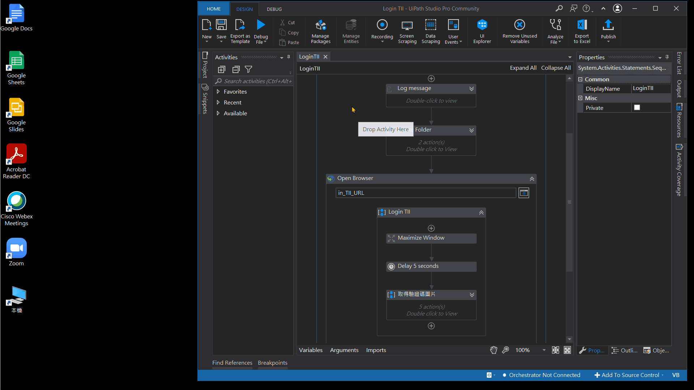

在這 6 次反覆重試登入中，各次驗證碼圖片的前處理及 OCR 識別結果如下:     
| 次數 | 原始驗證碼圖片 | 圖片前處理 | Tesseract OCR 識別 |
| :----------: | ---------- | ----------- | :-----------: |
| 1 | 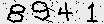 | 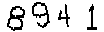 | **34** |
| 2 | 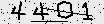 | 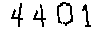 | **4441** |
| 3 | 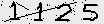 | 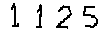 | **1425** |
| 4 | 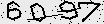 | 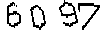 | **6037** |
| 5 | 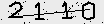 | 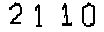 | **21410** |
| 6 | 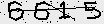 | 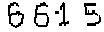 | **6615** |
<br/>   
 
   
## OpenCV 及 Tesseract OCR 的處理步驟    
透過 OpenCV 套件(Open Source Computer Vision Library)所提供圖片前處理的工具，能讓驗證碼圖片中的數字更清楚地呈現。
 
- ### Step 1 讀取驗證碼圖片 
```python
import cv2

# img_path : 驗證碼圖片的路徑(含副檔名 .png)
bgr_img = cv2.imread( img_path )

# Convert BGR to RGB
rgb_img = bgr_img[ :,:,::-1 ]
```   
 &larr; 原始驗證碼圖片

- ### Step 2 縮放驗證碼圖片   
>> 將原始圖片從 104 x 24 (寬x高)的原大小縮放成 104 x 32 的大小:
```python
img_pixel = cv2.resize( rgb_img, (104,32) )
```  
 

- ### Step 3 圖片二值化  
>> 透過圖片二值化(Image Binarization)的方法，能使圖片呈現出明顯的黑白效果，從而清楚地凸顯出圖片中的目標輪廓:
```python
img_pixel = cv2.threshold( img_pixel, 20, 255, cv2.THRESH_BINARY )[1]
```  
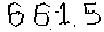

- ### Step 4 圖片去躁  
>> 透過圖片去躁(Image Denoising)的手法，能移除圖片中不必要且多餘的雜訊，從而保留住圖片中較重要的資訊:
```python
img_pixel = cv2.fastNlMeansDenoisingColored( img_pixel, None, 55, 55, 5, 15 )
```  
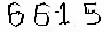

- ### Step 5 圖片二值化  
```python
img_pixel = cv2.threshold( img_pixel, 50, 255, cv2.THRESH_BINARY )[1]
```  
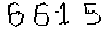

- ### Step 6 圖片侵蝕  
>> 影像形態學(Morphology)中的侵蝕(Erosion)手法，其作用為將圖像中高亮度的區域進行縮減；在本專案的範例中，經過二值化及去躁處理過後的驗證碼圖片，侵蝕能加粗圖片中的數字，使資訊更加明顯可見:
```python
img_pixel = cv2.erode( img_pixel, (5,5), iterations=1 )
```  


- ### Step 7 Tesseract OCR 辨識  
>> 經由上述 Step 2 ~ Step 6 前處理的過程後，使用 Tesseract OCR 套件對前處理過的圖片進行辨識:  
```python
#pip install pytesseract
import pytesseract

pytesseract.pytesseract.tesseract_cmd = r'C:\\Program Files\\Tesseract-OCR\\tesseract.exe'
text = pytesseract.image_to_string( img_pixel, lang='eng', config='--psm 7 --oem 3 -c tessedit_char_whitelist=0123456789' ) 
print( text )
```  
<br/>  


## 結論    
在這個簡單的範例中，雖然我們可藉由 OpenCV 的圖片前處理與 Tesseract OCR 的影像辨識，來幫助 RPA 機器人辨識出驗證碼中的資訊，但此方法仍有許多需改進的空間: 
- 首先，辨識的準確率不夠高，經作者實測的經驗，當 RPA 機器人成功登入時，平均每次需反覆重試的次數為 5 ~ 8 次，也就是說，每次執行需約 5 ~ 8 次的嘗試才能登入成功；
- 再者，若當驗證碼的圖片更加複雜時，例如: 英文字母與數字混合、字體更加歪斜、更多的干擾線等，將大福降低此方法的可行性。   

因此，對於其他網站的驗證碼識別，若經上述兩點考量後，發覺此方法並不可行時，建議可透過訓練一個 AI 模型: 卷積遞迴神經網絡(CRNN)，來克服此方法在技術上的不足與侷限。  
> 註: 如何訓練一個卷積遞迴神經網絡(CRNN)? 可參考[ CRNN_with_CTC_Loss ](https://github.com/YenLinWu/CRNN_with_CTC_Loss)。
<br/>  


## 參考文獻  
> (1) OpenCV 程式語法
- [Geometric Transformations of Images](https://opencv-python-tutroals.readthedocs.io/en/latest/py_tutorials/py_imgproc/py_geometric_transformations/py_geometric_transformations.html?highlight=resize "OpenCV 圖片縮放") 
- [Image Thresholding](https://opencv-python-tutroals.readthedocs.io/en/latest/py_tutorials/py_imgproc/py_thresholding/py_thresholding.html "OpenCV 圖片二值化")
- [Image Denoising](https://opencv-python-tutroals.readthedocs.io/en/latest/py_tutorials/py_photo/py_non_local_means/py_non_local_means.html "OpenCV 圖片去躁")
- [Morphological Transformations](https://opencv-python-tutroals.readthedocs.io/en/latest/py_tutorials/py_imgproc/py_morphological_ops/py_morphological_ops.html "OpenCV 圖片侵蝕")  
> (2) Tesseract 安裝
- [Tesseract at UB Mannheim](https://github.com/UB-Mannheim/tesseract/wiki "Tesseract 安裝檔下載")
- [Day26-聽過 OCR 嗎? 實作看看吧 -- pytesseract](https://ithelp.ithome.com.tw/articles/10227263 "Tesseract 安裝及實作")
- [Tesseract安裝](https://ithelp.ithome.com.tw/articles/10233316 "Tesseract 安裝步驟")


## 作者
<span> - &copy; Tom Wu (<a href="https://github.com/YenLinWu">Github</a>) </span>  
