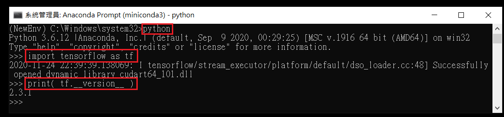
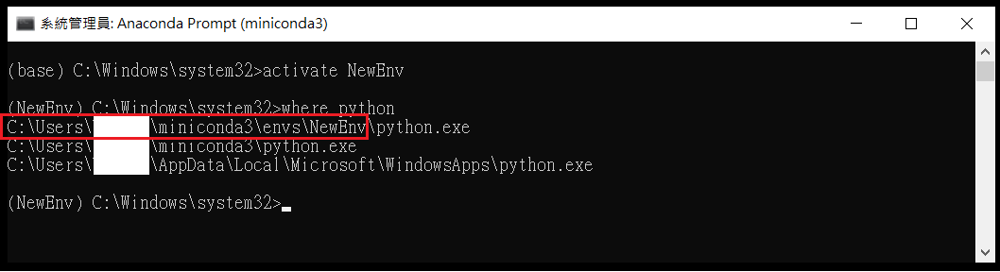
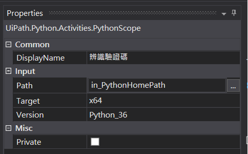

# TensorFlow 2.3 x CRNN x UiPath   
 

> 藉由 TensorFlow 2.3 建置及訓練一個卷積遞迴神經網絡( Convolutional Recurrent Neural Network, CRNN )模型，並將此模型配置於 UiPath 程式碼中，使得 RPA 機器人能精確地辨識驗證碼圖片。  
>> 註: 如何訓練一個卷積遞迴神經網絡(CRNN)? 請參考[ CRNN_with_CTC_Loss ](https://github.com/YenLinWu/CRNN_with_CTC_Loss)。  

  

## 系統環境
作者開發環境如下:

- Windows 10/ 16 GB RAM/ Intel i7 CPU/ GeForce GTX 1660 Ti   
- UiPath Studio Pro 2020.4.3 以上
- Python 3.6/ TensorFlow 2.3
<br/>  
   
## TensorFlow 2.x 環境建置步驟     
- ### Step 1 : 下載安裝 Miniconda  
>> 下載網址 : [Miniconda](https://docs.conda.io/en/latest/miniconda.html)

- ### Step 2 : 開啟 Anaconda Prompt(miniconda3)   
>> 【開始】&rarr; 以系統管理員身分執行【Anaconda Prompt(miniconda3)】

- ### Step 3 : 查看目前已有的虛擬環境     
```console
conda env list
```

- ### Step 4 : 創建新的 Python 3.6 虛擬環境  
```console
conda create --name 虛擬環境名稱 python=3.6
```
>> 註 : 截至專案當下，UiPath 中的 Python Activity 最高僅支援到 Python 3.6 版本。  
>> 註 : 刪除虛擬環境 ```conda env remove --name 虛擬環境名稱 ```

- ### Step 5 : 啟動新建立的 Python 3.6 虛擬環境  
```console
activate 虛擬環境名稱
```

- ### Step 6 : 安裝 TensorFlow 2.x 
```console
pip install "tensorflow>=2.0.0"
```

- ### Step 7 : 檢查 TensorFlow 2.x 是否安裝成功
>> 先輸入 `pyhton` 進入到 REPL( Read-Eval-Print-Loop )模式後，再匯入 TensorFlow 套件。
```console
python   
import tensorflow as tf 
print( tf.__version__ )
``` 

<br/>  


## UiPath 調用 TensorFlow 2.x 的設定        
- ### Step 1 : 查詢 Python 執行檔路徑
>> 在 Anaconda Prompt(miniconda3) 中啟動裝有 TensorFlow 2.x 的虛擬環境後，輸入 `where python` 進行查詢 :    


- ### Step 2 : PythonScope 屬性設定
>> 引數 in_PythonHomePath = "C:\Users\------\miniconda3\envs\NewEnv"  

<br/>  


## 參考文獻  
- [Img Recognition/Classification with Tensorflow2.0 + UiPath step by step — local](https://medium.com/@reginwon/img-recognition-with-tensorflow-uipath-step-by-step-38accc241662) 
- [輕鬆學習 Python：conda 的核心功能](https://medium.com/datainpoint/python-essentials-conda-quickstart-1f1e9ecd1025)
- [Installing TensorFlow 2.3.0 and Torch 1.6.0 on Windows 10 with CUDA Support](https://medium.com/@mhfateen/installing-tensorflow-2-3-0-and-torch-1-6-0-on-windows-10-with-cuda-support-97ea4ff4f8fa)  
- [GPU support | TensorFlow](https://www.tensorflow.org/install/gpu)


## 作者
<span> - &copy; Tom Wu (<a href="https://github.com/YenLinWu">Github</a>) </span>  
