# Tesseract OCR x UiPath   


> 當網站登入具驗證碼(Capctha)機制時，先藉由 OpenCV 對圖像的前處理後，再透過 Tesseract OCR 的影像識別，使得 RPA 機器人成功登入網站。   


## 示範  
本專案以 RPA 機器人登入[財團法人保險事業發展中心 保險統計資料庫加值服務](http://insdb.tii.org.tw/pivot/)為範例，本次執行登入過程中，在第 6 次執行時登入成功 :
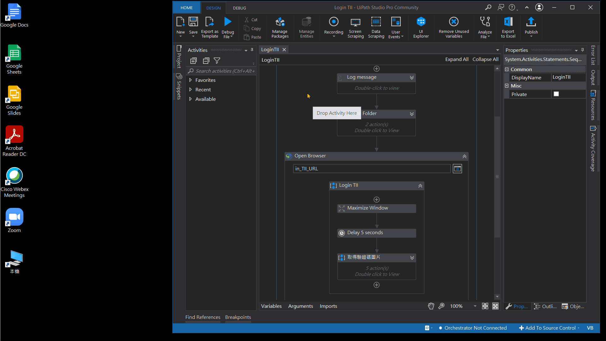

在這 6 次嘗試登入時，各次驗證碼圖片的前處理及 OCR 識別結果如下:     
| 次數 | 原始驗證碼圖片 | 圖片前處理 | Tesseract OCR 識別 |
| :----------: | ---------- | ----------- | :-----------: |
| 1 |  | 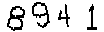 | **34** |
| 2 | 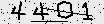 | 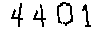 | **4441** |
| 3 | 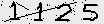 | 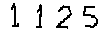 | **1425** |
| 4 |  | 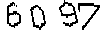 | **6037** |
| 5 | 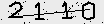 | 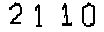 | **21410** |
| 6 |  |  | **6615** |
 
 
## OpenCV(Open Source Computer Vision Library)圖片前處理     
 
- ### Step 1 讀取驗證碼圖片  
```command
import cv2

# img_path : 驗證碼圖片的路徑(含副檔名 .png)
bgr_img = cv2.imread( img_path )

# Convert BGR to RGB
rgb_img = bgr_img[ :,:,::-1 ]
```   
 &larr; 原始驗證碼圖片
- ### Step 2 縮放驗證碼圖片  
```command
img_pixel = cv2.resize( rgb_img, (104,32) )
```  
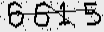 &larr; 將原始圖片縮放至寬為 104 高為 32 的大小
- ### Step 3 圖片二值化  
```command
img_pixel = cv2.threshold( img_pixel, 20, 255, cv2.THRESH_BINARY )[1]
```  
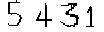
- ### Step 4 圖片去躁  
```command
img_pixel = cv2.fastNlMeansDenoisingColored( img_pixel, None, 55, 55, 5, 15 )
```  

- ### Step 5 圖片二值化  
```command
img_pixel = cv2.threshold( img_pixel, 50, 255, cv2.THRESH_BINARY )[1]
```  

- ### Step 6 圖片侵蝕  
```command
img_pixel = cv2.erode( img_pixel, (5,5), iterations=1 )
```  
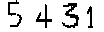

## 作者
<span> - &copy; Tom Wu (<a href="https://github.com/YenLinWu">Github</a>) </span>  
